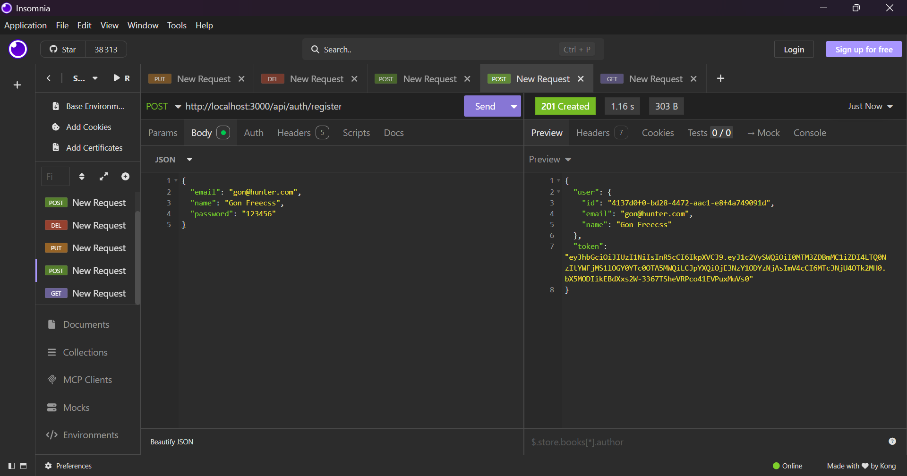
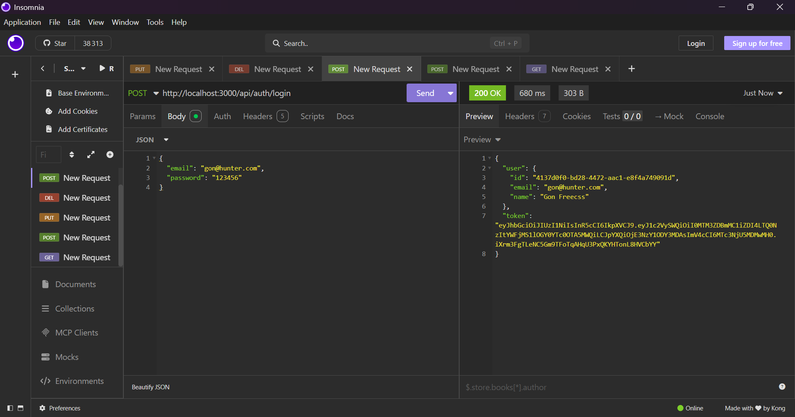
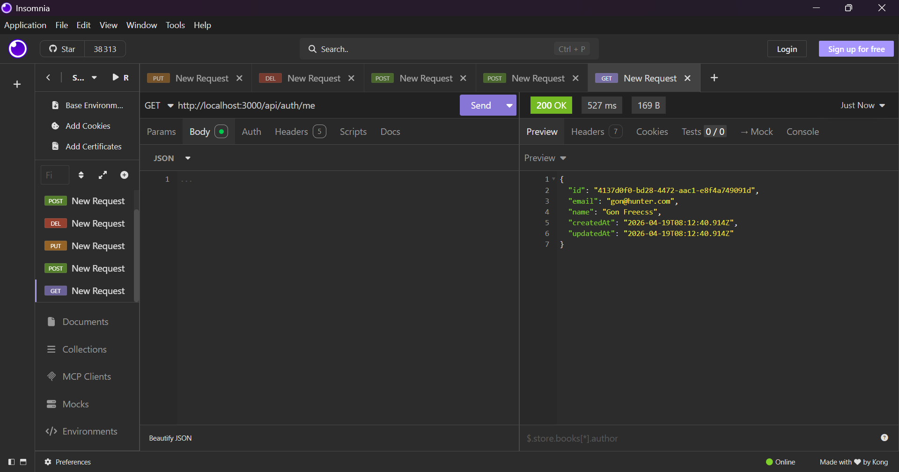
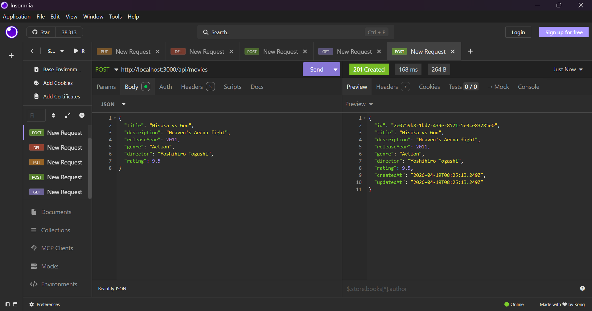
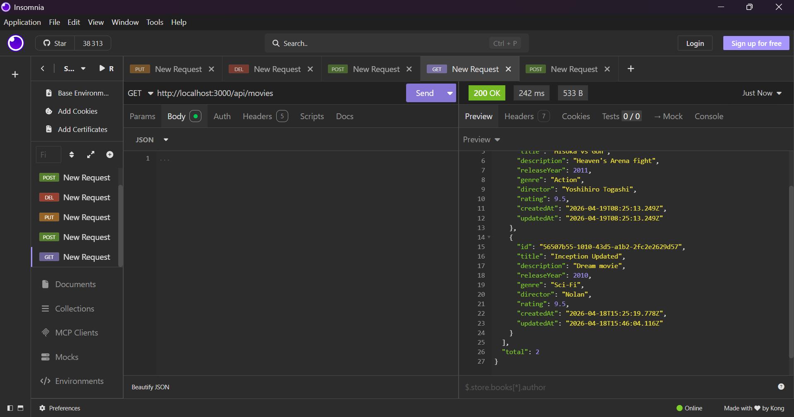
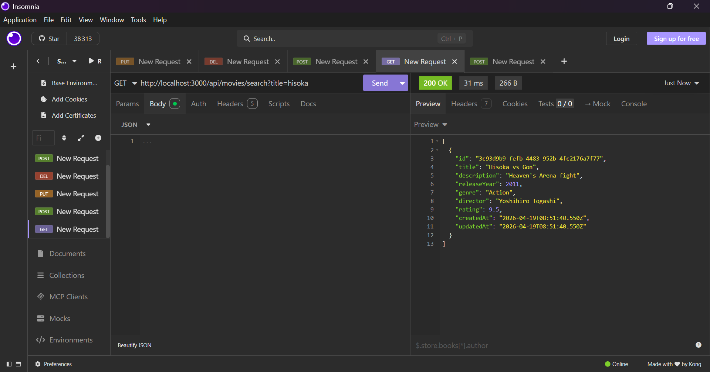
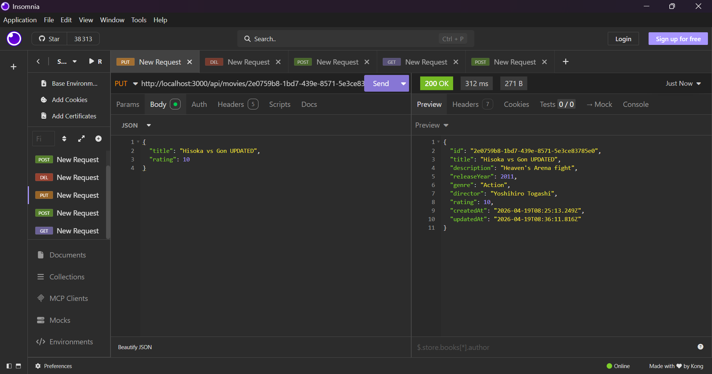
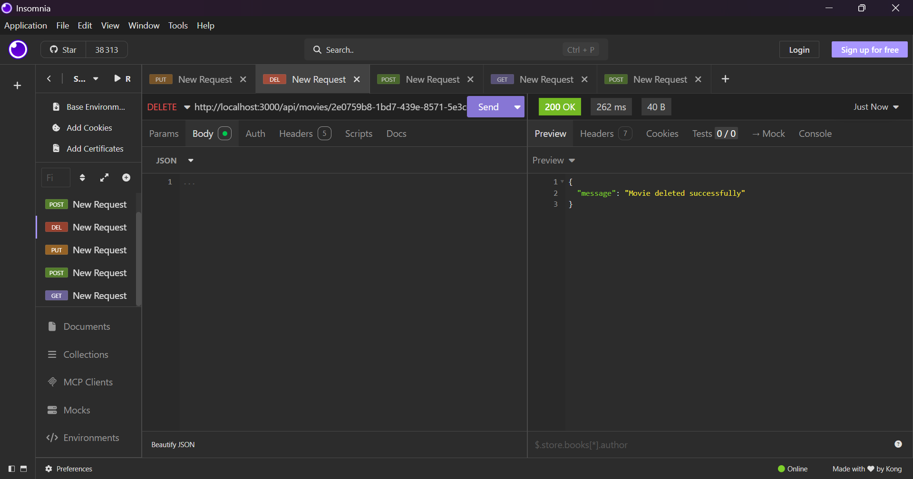
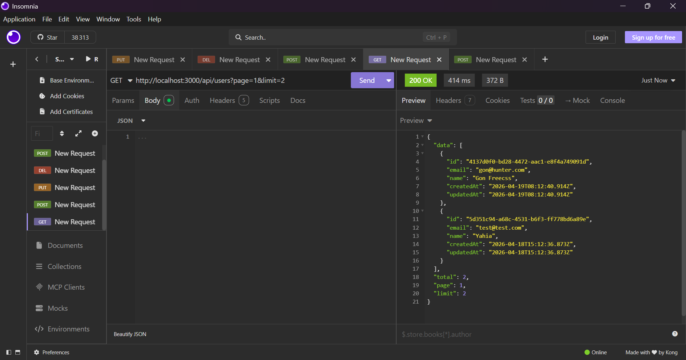

# 🎬 Users & Movies API

API REST développée avec **Node.js, Express et Prisma** permettant de gérer des utilisateurs et des films avec authentification JWT.

---

## 📸 Aperçu des tests API

### 🔐 Register


### 🔑 Login


### 👤 Get Me


### 🎬 Create Movie


### 📄 Get Movies


### 🔍 Search Movie


### 🔁 Update Movie


### 🗑️ Delete Movie


### 📊 Users Pagination


---

## 🚀 Fonctionnalités

### 🔐 Authentification
- Inscription (`/api/auth/register`)
- Connexion (`/api/auth/login`)
- Utilisateur connecté (`/api/auth/me`)

### 👤 Utilisateurs
- CRUD utilisateurs
- Pagination (`/api/users?page=1&limit=2`)
- Routes protégées
- Password sécurisé (bcrypt)

### 🎬 Movies
- CRUD complet
- Recherche (`/api/movies/search`)
- Routes protégées

---

## ▶️ Lancer le projet

```bash
npm install
npm run dev
